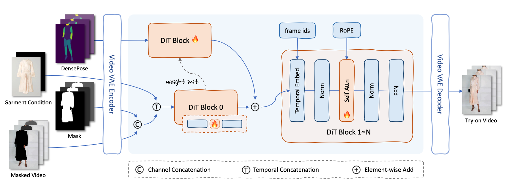

# CatV2TON: Taming Diffusion Transformers for Vision-Based Virtual Try-On with Temporal Concatenation

  
  
  
  <!--  -->
  <!--  -->
  <!--  -->
  

  

## Updates

- **`2025/01/20`**: Our paper has been published on **[ArXiv](http://arxiv.org/abs/2501.11325v1)**.
